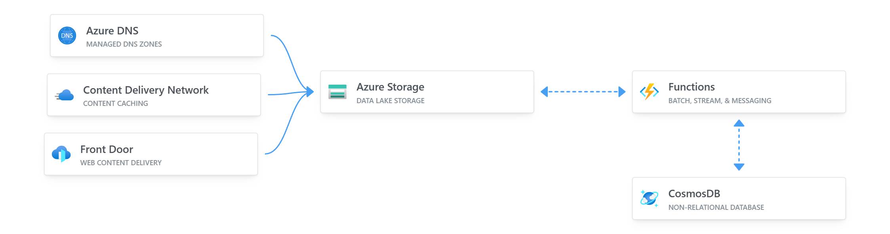

# Project Description
The Cloud Resume project is a static website hosted on Azure Storage, with a visitor counter built on Azure Functions. The website is built with HTML, CSS, and JavaScript. The visitor counter is built with .NET and Azure Functions.

# Project Structure

